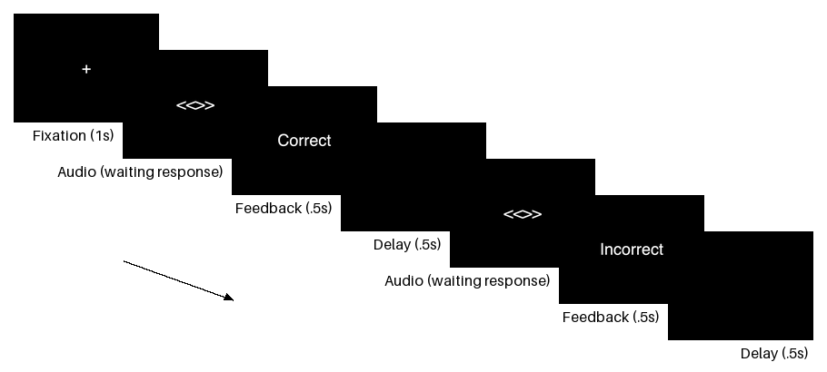

## Auditory N-Back Task
An implementation of an auditory working memory update task. On each trial participants hear a Turkish letter pronounced (see Material). They are expected to press "j" if it is the same letter that was played n trials earlier or to press "f" otherwise. The first n trials accept both keys as correct. The trials are self-paced with .5 second interval between response and the next trial. Both reaction time (RT) and accuracy are recorded. See Figure 1.



### Background
To be added.

### Quick Start
See quick start in [main README](/README.md) first.
```bash
$ cd very-first-experiment # make sure you are in the root
$ python3.10 -m auditory_n_back.sample # run sample file as a module
```

### Sample Results
To be added.

### Material
I recorded my voice in home settings pronouncing 28 letter of the Turkish alphabet (excluding the Ğ, "soft G", which has no sound alone). The individual raw audio file ([/recordings/raw](./recordings/raw)) for each letter is then trimmed to include only non-silent parts ([/recordings](./recordings)) using `PyDub`. No other preprocessing is done. Thus the material is not intended for production use.