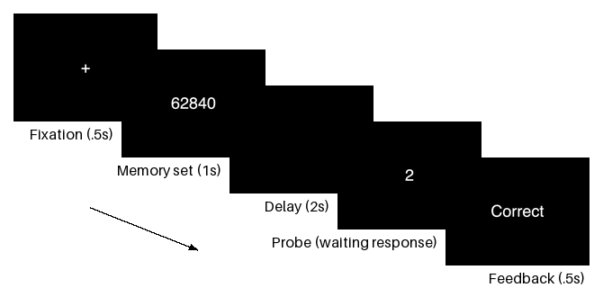

## Trial Flowchart
Generate beautiful trial flowcharts for PsychoPy tasks.

### Quick Example
* A flowchart consists of scenes. A scene is a Scene object which has three properties. First is a function that draws on PsychoPy window, which is a single stimulus (an image) in the task. Second is the name of the scene. Third is a short description which will be shown below the image.
* Here is a simple example for Sternberg task:
```python
# sternberg/flowchart.py
from src.flowchart import Scene, Flowchart
from .main import Sternberg

task = Sternberg() # initialize PsychoPy app
task.text_main.height = .3 # make text bigger

flowchart = Flowchart(task) # initizalize Flowchart object 

# specify each scene
flowchart.add_scenes([
    Scene(lambda: task.present("+"), "fixation", "Fixation (.5s)"),
    Scene(lambda: task.present("62840"), "memory_set", "Memory set (1s)"),
    Scene(lambda: task.present(""), "delay", "Delay (2s)"),
    Scene(lambda: task.present("2"), "probe", "Probe (waiting response)"),
    Scene(lambda: task.present("Correct"), "feedback", "Feedback (.5s)")
])

flowchart.generate("sternberg/fig/Figure_1.png") # generate flowchart
task.terminate() # don't forget to terminate PsyhoPy app
```
* This is the output:



### License
MIT