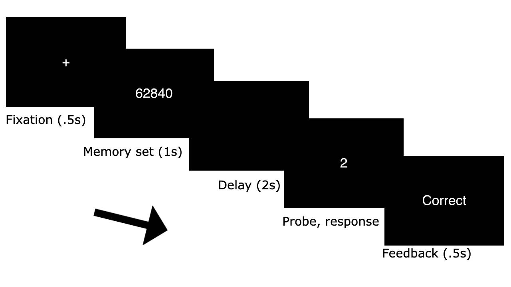
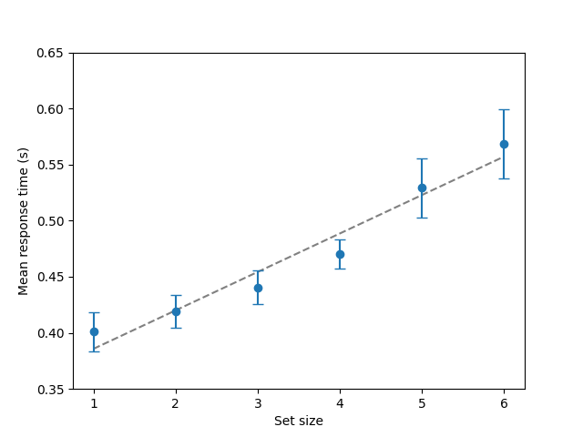
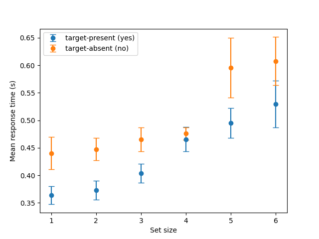

## Sternberg Task
A working memory task implementation based on Sternberg (1966). On each trial, participants see a sequence of digits (0-9, length 1-6) for 1 second, followed by 2 seconds delay and probe digit. They are expected to press "j" if the sequence included the probe or to press "f" otherwise. Both reaction time (RT) and accuracy are recorded. See Figure 1.



Figure 1. Trial flow.

I implemented this task as my first `PsychoPy` experiment. I chose it since it is a very classical task in cognitive psychology with many tasks later built on it, and it helped me to grasp `PsychoPy` basics.

### Background
Two main findings of the original experiment are (1) RT increases linearly with set size, and (2) memory search is serial exhaustive, which is indicated by present and absent trials sharing the same slope.

### Quick Start
See quick start in [main README](/README.md) first.
```bash
$ cd very-first-experiment # make sure you are in the root
$ python3.10 -m sternberg.sample # run sample file as a module
```

### Sample Results
I ran sample task myself for 300 trials. Then I ran a simple analysis and despite the small sample size, was able to see both classical trends. (Though I didn't run significance test.) See Figures 2-3.



Figure 2. RT as a function of set size.



Figure 3. Present and absent trials sharing the same slope.

### References
* Sternberg, S. (1966). High-speed scanning in human memory. *Science*, *153*(3736), 652–654.